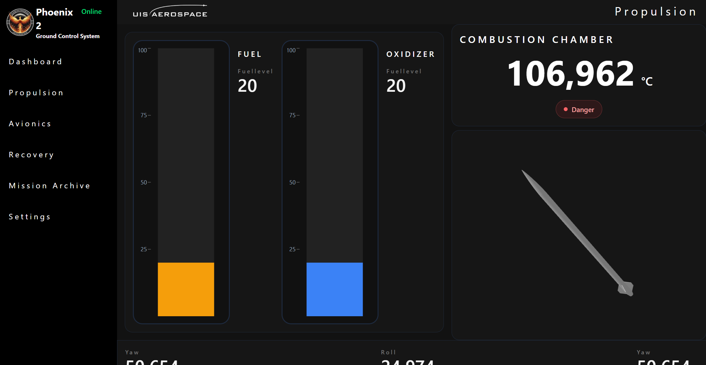

# bachelor-aerospace-gui

## Project description
The primary goal of this project is to develop a backend infrastructure that transmits telemetry data from the rocket’s flight computer to a database. This data will then be retrieved and presented on a interface, allowing launch controll to monitor the launch in real time.

## Preview

##

